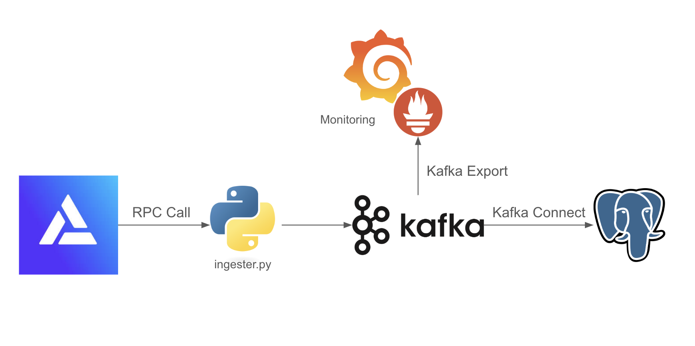
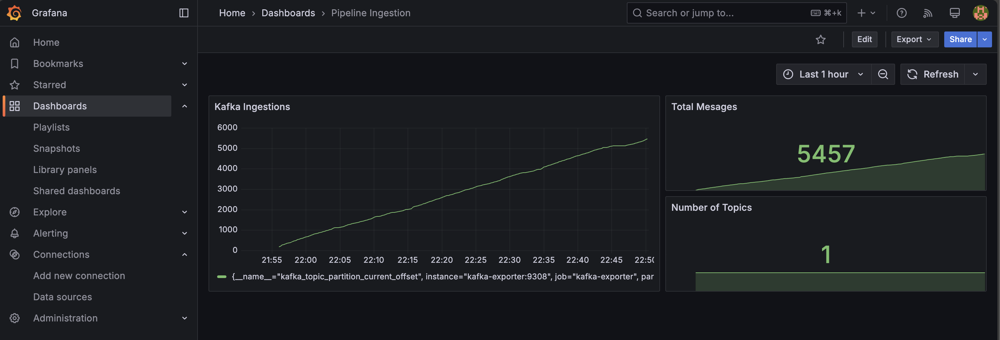

# Pipeline Setup and Configuration

### Diagram


In this repo, we use Alchemy's RPC to run a script that transforms the data into Kafka messages. 

We use Kafka-Connect to write to Postgres.

We use Kafka-export to write metrics to Promethus, and optionally run Grafana for monitoring.
 

We use the Swap event from Uniswap v3 USDC / ETH 0.05% pool 0x88e6a0c2ddd26feeb64f039a2c41296fcb3f5640 as an example.


### Prerequisites

- Docker and Docker Compose installed.

### Run the Pipeline 

From the root of the repo:

`docker-compose up -d`

This will start ingestion from the RPC to the Postgres table.

If a `state.json` exists, the pipeline will start from there.

If not, it will create one and start from the Head of the chain. 


### Shut down (With Volumes Delete)

`docker-compose down -v`


### Set Up Grafana

#### Start Kafka Exporter

Run the Kafka exporter after the pipeline starts (Kafka topics must be available first):

`docker-compose up kafka-exporter -d`


#### Run Grafana

1. Go to `http://localhost:3000/`
2. Log in with `USER=admin` and `PASSWORD=admin`
3. Set a new password
4. Add a new Data Source: `prometheus`
5. Use connection `http://prometheus:9090`
6. Go to Dashboards > New > Import
7. Paste the JSON from `/grafana/Pipeline Ingestion Dashboard.json`
8. Click `Load` and select `prometheus` as data source

You should see a dashboard like this


### How to Add a New Configuration

1. Navigate to `ingester/configs`.
2. Create or edit a JSON file with the following details:
   - `ethereum_rpc_url`: Ethereum RPC URL.
   - `pool_address`: Liquidity pool/contract address.
   - `kafka_topic`: Kafka topic for events.
   - `poll_interval`: Polling interval (in seconds).
   - `abi`: ABI for the smart contract event/function.
   - `schema`: Data schema for Kafka message format.
3. Add the `kafka-connector` sink JSON file to `ingester/kafka-sink-configs`.

Example:

```json
{
    "ethereum_rpc_url": "RPC_URL",
    "pool_address": "0xYourPoolAddress",
    "kafka_topic": "your-topic",
    "poll_interval": 10,
    "abi": [ ... ],
    "schema": { ... }
}
